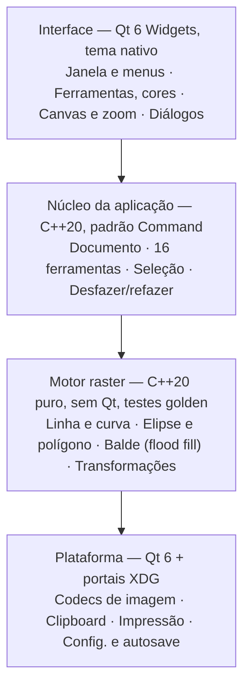

# PRD — LinuPaint: port do MS Paint clássico para Linux

2026-10-04 · Marco Lima

## Visão geral

O LinuPaint é um editor bitmap nativo para Linux que reproduz a usabilidade e o comportamento do MS Paint clássico, com visual nativo e moderno, em duas entregas: a **v1.0** cobre o Paint até o Windows XP e a **Fase 2 (v2.0)** chega à paridade com o Paint do Windows 7 (que é praticamente o mesmo do Windows 10). A v1.0 entrega as 16 ferramentas originais, a paleta de 28 cores, os menus clássicos e leitura/gravação de BMP, PNG, JPEG e GIF.

**Problema.** Usuários de Linux não têm um editor "abre e desenha" com o modelo mental do Paint. GIMP e Krita são poderosos demais para recortar um print ou rabiscar uma seta; Pinta e KolourPaint se aproximam, mas não replicam atalhos, ferramentas (ex.: seleção livre com fundo transparente, spray, curva de 2 pontos de controle) nem o fluxo do Paint. Projetos web como o JS Paint provam a demanda, mas não são apps nativos integrados ao desktop.

**Proposta.** Um binário leve, que inicia em menos de 300 ms, sem camadas nem histórico complexo, onde quem usou o Paint por 20 anos não precisa aprender nada.

## Objetivos e não-objetivos

**Objetivos**

1. Paridade funcional com o Paint do Windows XP: todas as ferramentas, menus e caixas de diálogo listados no Escopo.
2. Paridade de atalhos de teclado e de comportamento do mouse (botão esquerdo = cor primária, direito = secundária; Shift restringe ângulos e proporções).
3. App nativo, leve e integrado ao desktop Linux (X11 e Wayland, GNOME e KDE).
4. Distribuição simples: AppImage e pacotes .deb/.rpm nas releases. Flatpak/Flathub adiado (manifesto mantido no repositório).
5. Código aberto sob GPL-3.0 e sem nenhum ativo proprietário da Microsoft.

**Não-objetivos**

- Camadas, máscaras, filtros, pincéis com pressão ou gestão de cor (é o espaço do GIMP/Krita).
- Recursos do Paint do Windows 7 (Ribbon, antialiasing, pincéis de textura, galeria de formas) na v1.0: ficam para a Fase 2.
- Recursos exclusivos do Windows 10 (botão "Editar com Paint 3D").
- Edição vetorial, 3D (Paint 3D) ou recursos de IA.
- Versões para Windows/macOS na v1.0 (a arquitetura não deve impedir, mas não é meta).

## Público-alvo e personas

O público principal é quem migrou do Windows e quer edição rápida sem curva de aprendizado.

| Persona | Contexto | O que precisa | Critério de sucesso |
| --- | --- | --- | --- |
| Migrante do Windows | Usuário doméstico ou de escritório recém-chegado ao Linux | Mesmos menus, atalhos e ferramentas do Paint | Faz um recorte de print sem consultar ajuda |
| Profissional de suporte/dev | Anota capturas de tela para tickets e documentação | Colar da área de transferência, setas, retângulos, texto, salvar PNG | Ciclo colar → anotar → copiar em menos de 30 s |
| Educador e criança | Escolas com Linux Educacional, Edubuntu etc. | Interface simples, ícones grandes, sem riscos de perder trabalho | Aluno desenha e salva sozinho |
| Pixel artist nostálgico | Faz arte em baixa resolução e memes | Zoom até 800%, grade de pixels, lápis 1 px, paleta editável | Arte em pixel sem antialiasing indesejado |

## Escopo funcional

A v1.0 cobre as 16 ferramentas da caixa do Paint XP, a paleta de cores, quatro menus de edição e quatro formatos de arquivo. Prioridade: P0 = MVP, P1 = v1.0, P2 = pós-1.0 sem vínculo com uma versão do Paint. O escopo da paridade com o Windows 7 está em [Fase 2](#fase-2--paridade-com-o-paint-do-windows-7).

### Ferramentas

| Ferramenta | Comportamento esperado | Opções (painel abaixo da caixa) | Prioridade |
| --- | --- | --- | --- |
| Seleção livre | Laço à mão livre; mover, copiar com Ctrl+arrastar, carimbar com Shift+arrastar | Fundo opaco / transparente | P1 |
| Seleção retangular | Idem, retangular; alças de redimensionamento | Fundo opaco / transparente | P0 |
| Borracha / borracha de cor | Apaga para a cor secundária; com botão direito troca só a cor primária pela secundária | 4 tamanhos | P0 |
| Balde de tinta | Flood fill 4-conexo, sem tolerância (fiel ao original) | — | P0 |
| Selecionar cor (conta-gotas) | Pega cor primária/secundária e volta à ferramenta anterior | — | P0 |
| Lupa | Zoom 1x, 2x, 6x, 8x por clique; retângulo de pré-visualização | Níveis de zoom | P0 |
| Lápis | Traço 1 px sem antialiasing; Shift trava em 0/45/90° | — | P0 |
| Pincel | 12 pontas (círculo, quadrado, barras diagonais) em 3 tamanhos | 12 formatos | P0 |
| Spray (aerógrafo) | Pontos aleatórios em disco, densidade por tempo pressionado | 3 diâmetros | P1 |
| Texto | Caixa de texto flutuante; barra de fontes (fonte, tamanho, N/I/S) | Opaco / transparente | P1 |
| Linha | Reta; Shift trava em múltiplos de 45° | 5 espessuras | P0 |
| Curva | Linha + 2 cliques de controle (Bézier cúbica) | 5 espessuras | P1 |
| Retângulo | Shift = quadrado | Contorno / contorno+preenchimento / preenchimento | P0 |
| Polígono | Cliques sucessivos; duplo clique fecha | Idem | P1 |
| Elipse | Shift = círculo | Idem | P0 |
| Retângulo arredondado | Shift = quadrado | Idem | P1 |

### Cores

- Paleta de 28 cores idêntica à padrão do Paint, com indicador de cor primária/secundária (P0).
- Duplo clique numa cor abre "Editar cores" com cores personalizadas HSL/RGB (P1).
- Salvar/carregar paleta em .pal (P2).

### Menus

| Menu | Itens | Prioridade |
| --- | --- | --- |
| Arquivo | Novo, Abrir, Salvar, Salvar como, Visualizar impressão, Configurar página, Imprimir, Definir como papel de parede (lado a lado / centralizado), arquivos recentes, Sair | P0 (impressão e papel de parede P1) |
| Editar | Desfazer, Refazer (mínimo 50 níveis; o original tinha 3), Recortar, Copiar, Colar, Limpar seleção, Selecionar tudo, Copiar para arquivo, Colar de arquivo | P0 |
| Exibir | Caixa de ferramentas, Caixa de cores, Barra de status, Barra de texto, Zoom (normal, grande, personalizado, mostrar grade, mostrar miniatura), Ver bitmap em tela cheia | P0 (miniatura P1) |
| Imagem | Inverter/girar (horizontal, vertical, 90/180/270°), Alongar/inclinar (%, graus), Inverter cores, Atributos (largura, altura, unidades, preto e branco/cores), Limpar imagem, Desenhar opaco | P0 (inclinar P1) |
| Cores | Editar cores | P1 |
| Ajuda | Tópicos da ajuda, Sobre | P1 |

### Arquivos e integração

- Leitura e gravação: BMP (1, 4, 8, 24 bits), PNG, JPEG, GIF (P0); TIFF (Fase 2); ICO e WebP (P2).
- Abrir por argumento de linha de comando, arrastar e soltar e "Abrir com" do gerenciador de arquivos (P0).
- Área de transferência de imagem compatível com X11 e Wayland, nos dois sentidos (P0).
- Aviso de alterações não salvas ao fechar (P0).

### Extras (fora da paridade com o Paint)

Recursos que o Paint clássico não tem ficam no menu **Extras**, separados dos menus originais.

| Extra | Comportamento | Versão |
| --- | --- | --- |
| Inserir emoji | Extras > Inserir emoji abre um seletor com a lista completa do Unicode (Emoji 18.0, 9 grupos, ~1.900 emojis-base), busca por nome e palavra-chave em pt-BR, es e en (CLDR), tom de pele, recentes e campo livre; tamanho de 16 a 512 px. O emoji entra colorido como seleção flutuante com bordas suavizadas, que pode ser movida e redimensionada; desfazer em um passo. Emojis que a fonte instalada não desenha ficam ocultos | v1.0 |

## UX e fidelidade visual

A prioridade é a usabilidade idêntica, não o visual retrô. A disposição dos elementos replica o Paint XP para que nada mude de lugar: caixa de ferramentas em 2 colunas à esquerda, painel de opções abaixo dela, caixa de cores no rodapé, barra de status com posição do cursor e tamanho da seleção.

- **Tela (canvas):** fundo cinza-escuro ao redor, imagem ancorada no canto superior esquerdo, 3 alças (direita, inferior, canto) para redimensionar arrastando.
- **Visual:** tema "Nativo" como padrão (segue o tema do sistema e o modo escuro, ícones modernos e nítidos em HiDPI). Os ícones são redesenhados do zero, mas cada ferramenta mantém a metáfora do original (lápis, balde, lupa) para ser reconhecida de imediato. Um tema "Clássico" (cinza 3D, estilo Windows 98) é opcional e fica para depois da v1.0 (P2).
- **Mouse:** botão esquerdo desenha com a cor primária, direito com a secundária; Esc cancela a forma em andamento; preview "elástico" de formas durante o arrasto.
- **Atalhos:** Ctrl+N/O/S/P/Z/Y/X/C/V/A (arquivo e edição), Ctrl+T e Ctrl+L (mostrar caixa de ferramentas e de cores), Ctrl+Shift+N (limpar), Ctrl+PageUp/PageDown (zoom), Ctrl+G (grade), Ctrl+F (tela cheia), Ctrl+R (girar), Ctrl+W (alongar), Ctrl+I (inverter cores), Ctrl+E (atributos), Del (limpar seleção). Mapa completo a validar contra o Paint XP.
- **Comportamento de pixel:** sem antialiasing em nenhuma ferramenta de forma ou traço, como o original. Antialiasing apenas no texto, desativável.
- **Primeira execução:** abre direto numa tela branca no tamanho padrão (configurável), sem assistente nem tela de boas-vindas.

## Fase 2 — paridade com o Paint do Windows 7

A Fase 2 (v2.0) adiciona o que o Paint ganhou no Windows 7, sem remover nada da v1.0. Como o Paint do Windows 10 é praticamente igual ao do 7, ele também fica coberto.

| Área | v1.0 (até o XP) | Fase 2 (até o Windows 7) |
| --- | --- | --- |
| Interface | Menus clássicos e caixa de ferramentas | Modo "Ribbon" como padrão (abas Início e Exibir, botão de menu do aplicativo, barra de acesso rápido); o modo clássico continua selecionável em Exibir e nas preferências |
| Antialiasing | Nenhum | Antialiasing em formas e pincéis no modo Windows 7; o modo clássico continua com pixel exato |
| Pincéis | 1 pincel com 12 pontas + spray | 9 tipos: pincel, caligrafia 1 e 2, aerógrafo, óleo, giz de cera, marcador, lápis natural, aquarela |
| Formas | 6 formas | Galeria de 23 formas: também triângulo, triângulo retângulo, losango, pentágono, hexágono, 4 setas, estrelas de 4/5/6 pontas, 3 balões de fala, coração, raio |
| Contorno e preenchimento | Contorno, preenchimento ou ambos | Também com texturas: giz de cera, marcador, óleo, lápis natural, aquarela |
| Espessura | Opções diferentes por ferramenta | Seletor único com 4 espessuras |
| Paleta | 28 cores | 20 cores + 10 espaços personalizados no modo Windows 7 |
| Imagem | Girar, alongar/inclinar, atributos | Botão "Cortar" |
| Seleção | Opaca ou transparente | Também inverter seleção e excluir |
| Zoom | 1x, 2x, 6x, 8x e personalizado | Controle deslizante de 12,5% a 800% |
| Exibir | Grade, miniatura, tela cheia | Réguas |
| Atalhos | Mapa do XP (Ctrl+R = girar) | Mapa do Windows 7 no modo Ribbon (Ctrl+R = réguas) |
| Formatos | BMP, PNG, JPEG, GIF | TIFF |
| Entrada | Mouse e teclado | Multitoque e caneta |

- **Arquitetura:** os novos pincéis e o antialiasing entram no motor raster como implementações novas, sem alterar os algoritmos de pixel exato da v1.0. O modo Ribbon é outra camada de interface sobre o mesmo núcleo.
- **Fidelidade:** os testes golden da Fase 2 são gerados numa VM com Windows 7, com as mesmas regras da v1.0.

## Requisitos não funcionais

| Área | Requisito | Meta |
| --- | --- | --- |
| Desempenho | Tempo de inicialização a frio até a janela utilizável | < 300 ms em hardware de 2018 |
| Desempenho | Latência entre movimento do mouse e pixel na tela | < 16 ms (60 fps) em imagem 4000×4000 |
| Desempenho | Flood fill em imagem 4000×4000 | < 200 ms |
| Recursos | Memória em repouso com imagem 1920×1080 | < 80 MB |
| Recursos | Tamanho do pacote (AppImage) | < 15 MB |
| Compatibilidade | Sessões X11 e Wayland; GNOME 45+, KDE Plasma 6, XFCE 4.18 | 100% das ferramentas P0 funcionando |
| Compatibilidade | Distros de referência | Ubuntu 24.04, Fedora 41, Debian 13, Arch |
| Compatibilidade | Escala HiDPI fracionária (125%, 150%, 200%) | Canvas nítido, sem borrão de pixel |
| Empacotamento | Flatpak (Flathub), AppImage, .deb, .rpm; Snap Store avaliada após a v1.0 | Todos gerados pelo CI a cada release |
| Confiabilidade | Recuperação após travamento | Autosave a cada 2 min em ~/.local/state |
| Acessibilidade | Navegação por teclado em menus e diálogos; rótulos para leitores de tela (AT-SPI) | Orca lê todos os controles |
| i18n | Interface traduzível (Qt Linguist, .ts/.qm, suportado pelo Weblate). Idioma-fonte en-US (as strings do código). pt-BR (`linupaint_pt_BR.ts`) e espanhol latino-americano neutro, com base no es-MX (`linupaint_es.ts`, para atender qualquer locale es_*), mantidos pela equipe; demais idiomas pela comunidade no Hosted Weblate; fallback para en-US | en-US, pt-BR e es completos na v1.0 |
| Segurança | Decodificadores de imagem testados com fuzzing | Zero crash em 24 h de fuzzing por formato |

## Arquitetura técnica

Stack definida: C++20 com Qt 6 Widgets, separado em quatro camadas, com o motor raster isolado de qualquer dependência de interface.

Cada camada só chama a de baixo; o motor raster recebe um buffer RGBA e devolve pixels, o que permite testes golden sem abrir janela.

- **Por que Qt 6:** Widgets entrega barra de menus, caixas de ferramentas acopláveis, integração com o tema do sistema, impressão (QPrinter), clipboard X11/Wayland e acessibilidade AT-SPI prontos; a Ribbon da Fase 2 sai com widgets próprios. GTK 4 também atenderia, mas o visual libadwaita incentiva menus em popover em vez da barra de menus tradicional do Paint.
- **Motor raster próprio:** algoritmos sem antialiasing (Bresenham, elipse por ponto médio, Bézier discretizada, flood fill por varredura de linhas) para reproduzir o pixel do Paint; QPainter só para exibir o resultado.
- **Desfazer:** pilha de comandos com snapshot do retângulo afetado (não da imagem inteira), limite configurável por memória.
- **Codecs:** plugins de imagem do Qt para PNG/JPEG/GIF; escritor de BMP próprio para 1/4/8/24 bits com paleta.
- **Integração:** portais XDG (abrir/salvar, papel de parede) para funcionar dentro do sandbox Flatpak.
- **Build e CI:** CMake, testes com Catch2, CI no GitHub Actions gerando Flatpak, AppImage, .deb e .rpm.

## Métricas de sucesso

O sucesso da v1.0 é medido por fidelidade ao original, adoção e estabilidade, sem telemetria embutida.

| Métrica | Como medir | Meta em 6 meses após v1.0 |
| --- | --- | --- |
| Fidelidade funcional | Checklist de paridade (ferramentas, menus, atalhos) contra Paint XP | ≥ 95% dos itens P0+P1 |
| Fidelidade de pixel | Testes golden: mesmas operações no Paint XP e no LinuPaint, comparação pixel a pixel | 100% idênticos para lápis, linha, retângulo, elipse, balde |
| Teste de usabilidade | 10 usuários de Paint fazem 5 tarefas sem ajuda | ≥ 9 de 10 concluem todas |
| Adoção | Downloads no Flathub + releases do GitHub | 50 mil instalações |
| Comunidade | Estrelas no GitHub; contribuidores externos | 3 mil estrelas; 20 contribuidores |
| Estabilidade | Issues de crash abertas por release | < 3 por release menor |
| Avaliação | Nota no Flathub / GNOME Software | ≥ 4,5 de 5 |

## Roadmap

Estimativa para uma equipe de 2 desenvolvedores: MVP no mês 4 e v1.0 no mês 7, cada fase liberada por um portão de qualidade.

| Fase | Período | Entregas | Portão de saída |
| --- | --- | --- | --- |
| Fundação | Meses 1 e 2 | Motor raster + testes; canvas, zoom, grade; abrir/salvar PNG e BMP | — |
| MVP | Meses 3 e 4 | Ferramentas P0; menus P0 e atalhos; clipboard X11/Wayland | Todos os itens P0 prontos; testes golden 100% verdes |
| v1.0 | Meses 5 a 7 | Ferramentas P1; i18n; Flatpak, AppImage, .deb | Paridade P0+P1 ≥ 95%; usabilidade 9 de 10 |
| Fase 2 (v2.0) | A estimar após a v1.0 | Paridade com o Paint do Windows 7: modo Ribbon, antialiasing, 9 pincéis, 23 formas, Cortar, réguas, TIFF, toque | Paridade com o Windows 7 ≥ 95%; testes golden da Fase 2 verdes |
| Pós-1.0 (P2) | Em paralelo à Fase 2 | ICO, WebP, paletas .pal, plugins | — |

A v1.0 é o primeiro entregável (paridade até o XP); a Fase 2 só começa depois do portão da v1.0. Nenhuma fase avança sem cumprir os critérios do portão; as durações são estimativas a revisar após a Fundação.

## Riscos e perguntas em aberto

O maior risco é jurídico: "Paint" e os ícones são marcas e ativos da Microsoft, então o produto replica comportamento, nunca arte ou nome.

| Risco | Impacto | Mitigação |
| --- | --- | --- |
| Uso de marca, ícones ou sons da Microsoft | Alto: remoção do Flathub, notificação extrajudicial | Nome próprio (LinuPaint), ícones e textos 100% originais, nenhuma referência a "MS Paint" na loja além de comparação descritiva |
| Clipboard de imagem inconsistente no Wayland | Médio: quebra o fluxo principal da persona de suporte | Testar cedo em GNOME e KDE; usar MIME image/png; testes automatizados em CI com sessão Wayland headless |
| Fidelidade de algoritmos (curva, spray, elipse) sem código-fonte original | Médio | Engenharia por observação (clean room) com testes golden gerados em VM com Windows XP |
| Escopo cresce com pedidos de camadas, filtros etc. | Médio | Não-objetivos explícitos; plugins só após v1.0 |
| Concorrência com Pinta, KolourPaint, JS Paint | Baixo | Diferencial = fidelidade total + app nativo leve |

**Decisões tomadas**

- [x] Versão de referência: v1.0 até o Windows XP; Fase 2 até o Windows 7.
- [x] Licença: GPL-3.0 + CLA (CLA Assistant) a partir da primeira contribuição externa, preservando a opção de vender ou relicenciar.
- [x] Stack: C++20 + Qt 6.
- [x] Snap Store: avaliar depois da v1.0.
- [x] Traduções: en-US (fonte), pt-BR e es (latino-americano, base es-MX) pela equipe na v1.0; demais idiomas pela comunidade no Hosted Weblate.
- [x] Fase 2: o modo Ribbon é o padrão, e o modo clássico fica selecionável.
